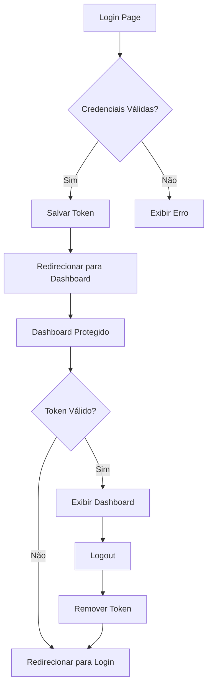

# Implementação do Mock Service Worker (MSW) no Projeto

## 📋 Visão Geral

Este documento descreve a implementação completa do Mock Service Worker (MSW) no projeto Synapse AI, permitindo interceptar e simular requisições HTTP durante o desenvolvimento, facilitando testes e desenvolvimento frontend independente do backend.

## 🏗️ Estrutura de Arquivos Criados

```
src/
├── types/
│   └── auth.ts              # Tipos TypeScript para autenticação
├── lib/
│   ├── api.ts              # Cliente HTTP centralizado
│   └── msw.ts              # Configuração de inicialização do MSW
├── mocks/
│   ├── handlers.ts         # Handlers de interceptação de requisições
│   └── browser.ts          # Configuração do MSW para browser
└── components/
    └── MSWProvider.tsx     # Provider React para inicialização do MSW
```

## 🔧 Componentes Implementados

### 1. Tipos de Autenticação (`src/types/auth.ts`)

Define as interfaces TypeScript para todas as operações de autenticação:

- **LoginRequest/LoginResponse**: Dados de login e resposta
- **SignupRequest/SignupResponse**: Dados de cadastro e resposta  
- **ForgotPasswordRequest/ForgotPasswordResponse**: Recuperação de senha
- **ApiError**: Estrutura padronizada de erros da API
- **User**: Dados do usuário autenticado

### 2. Cliente HTTP Centralizado (`src/lib/api.ts`)

Cliente HTTP baseado em fetch com:
- **Configuração base**: URL da API e headers padrão
- **Tratamento de erros**: Conversão automática de erros HTTP
- **Métodos específicos**: login, signup, forgotPassword, logout, getCurrentUser
- **Tipagem forte**: Uso dos tipos definidos em `auth.ts`

### 3. Handlers do MSW (`src/mocks/handlers.ts`)

Interceptadores de requisições HTTP que simulam:

#### 🔐 POST /api/auth/login
- Valida credenciais (email/senha)
- Simula delay de rede (500-1500ms)
- Retorna JWT token mock e dados do usuário
- Trata erros de credenciais inválidas

#### 📝 POST /api/auth/signup  
- Valida dados de cadastro
- Verifica email duplicado
- Simula criação de conta
- Retorna confirmação de sucesso

#### 🔑 POST /api/auth/forgot-password
- Valida formato do email
- Simula envio de email de recuperação
- Retorna confirmação de envio

#### 🚪 POST /api/auth/logout
- Simula logout do usuário
- Retorna confirmação de sucesso

#### 👤 GET /api/auth/me
- Simula busca de dados do usuário atual
- Valida token de autorização
- Retorna dados do usuário ou erro 401

### 4. Configuração do Browser (`src/mocks/browser.ts`)

- Configura o service worker do MSW
- Inicializa interceptação de requisições
- Logs de desenvolvimento
- Tratamento de requisições não interceptadas

### 5. Inicialização do MSW (`src/lib/msw.ts`)

- Inicialização assíncrona e condicional
- Executa apenas em desenvolvimento
- Executa apenas no browser (não no servidor)
- Import dinâmico para evitar inclusão em produção

### 6. Provider React (`src/components/MSWProvider.tsx`)

- Componente que inicializa o MSW antes da renderização
- Estado de loading durante inicialização
- Renderização condicional dos filhos
- Integração com o layout principal

## 🔄 Migração das Páginas de Autenticação

### Página de Login (`src/app/auth/signin/page.tsx`)

**Antes (Mock):**
```typescript
const onSubmit = async (data) => {
  setIsLoading(true);
  await new Promise(resolve => setTimeout(resolve, 2000));
  console.log("Login data:", data);
  setIsLoading(false);
};
```

**Depois (HTTP Real):**
```typescript
const onSubmit = async (data: LoginFormData) => {
  setIsLoading(true);
  setLoginError(null);
  
  try {
    const requestData: LoginRequest = {
      email: data.email,
      password: data.password,
    };
    
    const response = await apiClient.login(requestData);
    console.log("Login successful:", response);
    // Redirecionar usuário ou atualizar estado global
  } catch (error: any) {
    setLoginError(error.message || "Erro ao fazer login");
  } finally {
    setIsLoading(false);
  }
};
```

### Página de Cadastro (`src/app/auth/signup/page.tsx`)

**Migração similar** com:
- Uso do `apiClient.signup()`
- Tratamento de erros específicos
- Validação de dados de entrada
- Feedback visual de erros

### Página de Recuperação de Senha (`src/app/auth/forgot-password/page.tsx`)

**Migração similar** com:
- Uso do `apiClient.forgotPassword()`
- Validação de email
- Confirmação de envio
- Tratamento de erros

## 🎯 Benefícios da Implementação

### 1. **Desenvolvimento Independente**
- Frontend pode ser desenvolvido sem backend funcional
- Testes de interface sem dependências externas
- Simulação de cenários de erro e sucesso

### 2. **Consistência de API**
- Contratos de API bem definidos
- Tipagem forte com TypeScript
- Padronização de respostas e erros

### 3. **Facilidade de Testes**
- Cenários controlados e reproduzíveis
- Simulação de latência de rede
- Testes de casos extremos

### 4. **Experiência de Desenvolvimento**
- Feedback imediato durante desenvolvimento
- Logs detalhados de requisições
- Não afeta bundle de produção

## 🚀 Como Usar

### 1. **Desenvolvimento Local**
```bash
npm run dev
```
O MSW será automaticamente inicializado e interceptará as requisições.

### 2. **Verificar Funcionamento**
- Acesse as páginas de autenticação
- Teste login com credenciais válidas/inválidas
- Teste cadastro e recuperação de senha
- Verifique logs no console do navegador

### 3. **Credenciais de Teste**
```
Email: admin@synapse.ai
Senha: admin123
```

### 4. **Desabilitar MSW**
Para desabilitar temporariamente, comente a inicialização em `layout.tsx`:
```typescript
// <MSWProvider>
  {children}
// </MSWProvider>
```

## 🔧 Configuração e Personalização

### Adicionar Novos Endpoints

1. **Definir tipos** em `src/types/auth.ts`
2. **Criar handler** em `src/mocks/handlers.ts`
3. **Adicionar método** em `src/lib/api.ts`
4. **Usar nas páginas** conforme necessário

### Modificar Comportamento

- **Latência**: Ajustar delays nos handlers
- **Dados mock**: Modificar respostas simuladas
- **Validações**: Alterar regras de validação
- **Erros**: Simular diferentes cenários de erro

## 📝 Próximos Passos

1. **Testes Automatizados**: Implementar testes unitários e de integração
2. **Mais Endpoints**: Adicionar outros endpoints da aplicação
3. **Persistência**: Implementar localStorage para dados mock
4. **Cenários Avançados**: Simulação de timeouts, falhas de rede, etc.

## 🆕 Funcionalidades Adicionais Implementadas

### Dashboard e Autenticação Completa

#### 📊 Página de Dashboard (`src/app/dashboard/page.tsx`)
- **Layout responsivo**: Interface moderna com sidebar e header
- **Proteção de rota**: Verificação automática de autenticação
- **Dados do usuário**: Exibição de informações do usuário logado
- **Logout integrado**: Funcionalidade completa de saída
- **Cards informativos**: Estatísticas e métricas simuladas
- **Atividades recentes**: Lista de ações do usuário
- **Tarefas pendentes**: Sistema de to-do integrado

#### 🔐 Melhorias na Autenticação
- **Redirecionamento automático**: Login redireciona para `/dashboard`
- **Gerenciamento de token**: Armazenamento seguro no localStorage
- **Headers automáticos**: Token incluído automaticamente nas requisições
- **Logout completo**: Remoção de token e redirecionamento

#### 🔧 Atualizações no Cliente HTTP (`src/lib/api.ts`)
- **Método logout()**: Gerenciamento completo da saída do usuário
- **Headers automáticos**: Inclusão automática do token de autorização
- **Verificação SSR**: Proteção contra erros de localStorage no servidor

### Fluxo de Autenticação Completo



### Estrutura de Arquivos Atualizada

```
src/
├── app/
│   ├── auth/
│   │   ├── signin/page.tsx     # ✅ Login com redirecionamento
│   │   ├── signup/page.tsx     # ✅ Cadastro com validação
│   │   └── forgot-password/page.tsx # ✅ Recuperação de senha
│   └── dashboard/
│       └── page.tsx            # 🆕 Dashboard protegido
├── types/
│   └── auth.ts                 # Tipos TypeScript para autenticação
├── lib/
│   ├── api.ts                  # ✅ Cliente HTTP com logout e headers
│   └── msw.ts                  # Configuração de inicialização do MSW
├── mocks/
│   ├── handlers.ts             # Handlers de interceptação de requisições
│   └── browser.ts              # Configuração do MSW para browser
└── components/
    └── MSWProvider.tsx         # Provider React para inicialização do MSW
```

## 🐛 Troubleshooting

### MSW não está interceptando requisições
- Verifique se o service worker foi registrado
- Confirme que está em modo de desenvolvimento
- Verifique logs no console do navegador

### Erros de TypeScript
- Confirme que todos os tipos estão importados
- Verifique compatibilidade das interfaces
- Execute `npm run type-check`

### Requisições não encontradas
- Verifique se o handler está registrado
- Confirme a URL e método HTTP
- Adicione logs para debug

---

**Implementação concluída com sucesso!** 🎉

O MSW está agora totalmente integrado ao projeto, proporcionando uma experiência de desenvolvimento robusta e independente para as funcionalidades de autenticação.